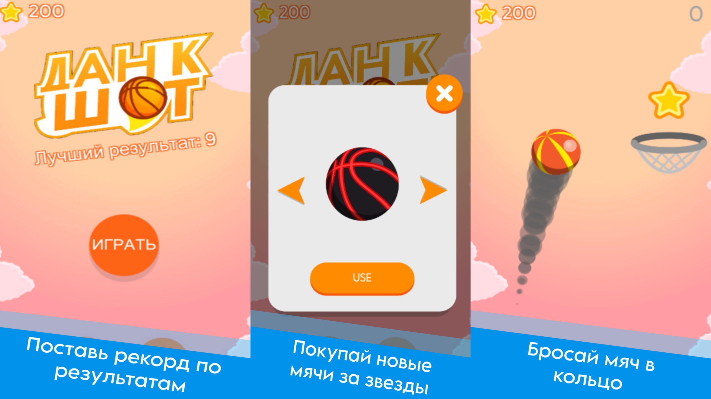
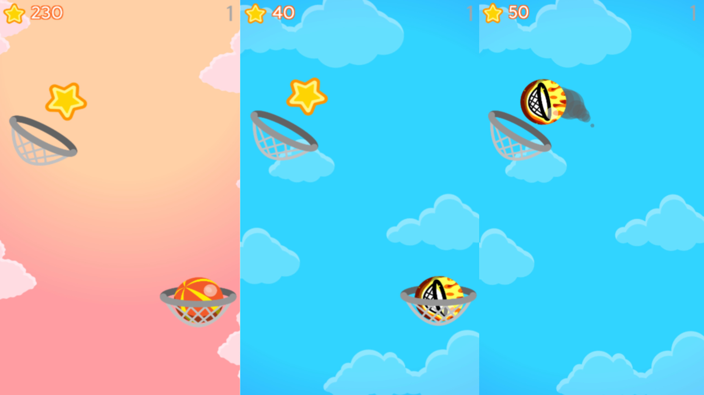

# 🏀 Данк Шот – аркадный баскетбольный челлендж

> Динамичная аркадная игра, где ты запускаешь баскетбольный мяч из одной корзины в другую, стараясь не дать ему упасть вниз. Чем выше поднимаешься, тем сложнее броски и тем больше награда. Собирай звёзды, открывай новые скины и удивляй точными попаданиями!

---

## 🕹️ Особенности

- Захватывающий аркадный геймплей  
- Бросай мяч из корзины в корзину, поднимаясь всё выше  
- Постепенно растущая сложность и новые испытания  
- Собирай звёзды для разблокировки ярких скинов  
- Атмосфера динамики и азарта в каждом броске  

---

## 🔧 Платформы

- WebGL (Яндекс.Игры)  
- ПК и мобильные браузеры  

---

## 👨‍💻 Разработка

Игра сделана мной.

---

## 📸 Скриншоты

  
   

---

## 🎥 Видео

[Посмотреть геймплей на YouTube](https://youtube.com/shorts/XXXXXXXXXXX)  

---

## 📌 Статус

✅ Базовый функционал готов  
🔄 В разработке новые режимы и улучшения  

---

## 📫 Контакты

- Telegram: [@davidmadridov](https://t.me/davidmadridov)
